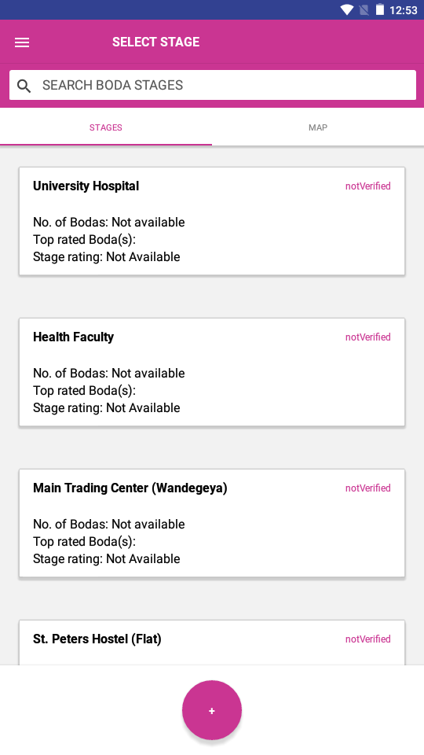
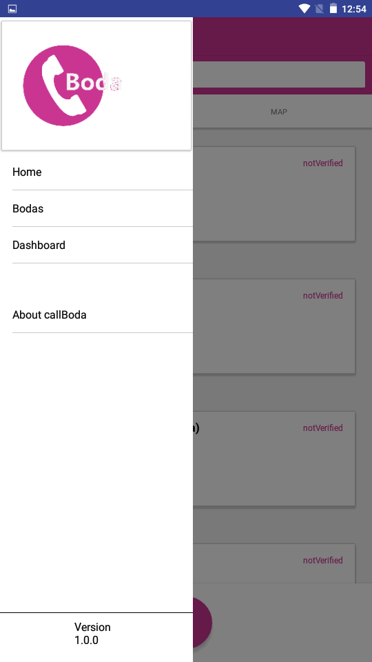

# CallBoda


CallBoda is a phone call based ride hailing App that contains Boda-Boda contact details along with the Boda stage each Boda guy operates from.
With Boda hailing services only present in areas around the capital city (Kampala) of Uganda, the 
rest of the country is left un-attended to. CallBoda comes in to provide a similar Boda hailing experience to the rest of the country by making sure that no matter where one is, one can have 
access to Boda-Bodas around them.


* **Directly call a Boda** from a selected stage.
* **Add New a Boda** to a selected Boda stage.
* Search **Boda stages**
* **Boda** and **Boda Stage** Ratings.

## Screenshots.
<div>
     
     
</div>

## How It Works
 Depending on one's location, one is able to access and make calls to Boda Bodas from stages nearest to them.
.

## Setup Instructions.

    ```sh
    $ git clone https://github.com/kal-J/callBoda.git
    $ cd frontend
    $ npm install
    $ expo start
    ```
